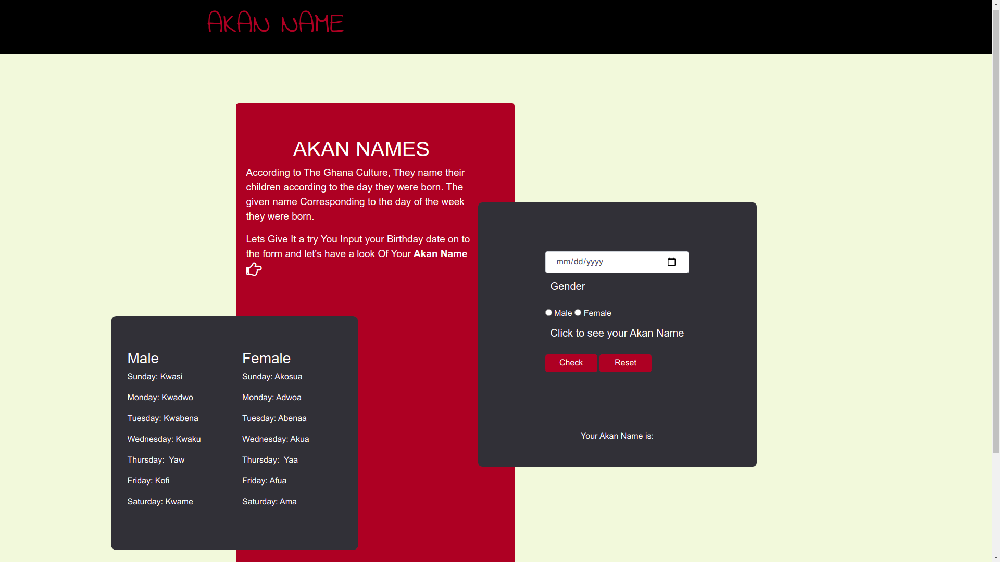

# Akan Birthday  Names

#### Created on 10th April 2021
#### By Samuel Maingi Mutunga

## Description 

It's a Web Application that uses the Ghanian Culture to Output the User's Birthday ghanian Name which is known as `AKAN NAME`. It works when the user inputs their Birth-Day and it Calculates the day of the Week they were born and depending on the gender of the User the respective name is Outputted to the Screen.

The Formula Used `(DD+(((MM+1)26)/10)+YY+(YY/4)+6*(YY/100)+(YY/400)-1)mod7;`

`DD` - Day    `MM` - Month   `YY` - Year

The Application

---

## Access the website
Need the latest browser to be able to View

Follow this link https://layersony.github.io/birthday-akan-name/

It is hosted by github.

---

### Setup
To access this project on your local files, you can clone it using these steps
1. Open your terminal
1. Use this command to clone `$ git clone https://github.com/layersony/birthday-akan-name.git`
1. This will clone the repositoty into your local folder
1. Run `index.html` with active internet
1. __Enjoy :)__

---

## Behaviour Driven Development

1. Displays Form For Entering Date and Gender
   - INPUT: User Enters Birth-Day via a Calander
   - INPUT: User chooses either Male or Female
   - OUTPUT: Akan Name is Diplayed According What the User as Entered and Choose
2. Displays an Error Message if Date Input Left Blank
   - INPUT: ""
   - OUTPUT: Empty Value, Choose a Valid Date
3. Displays an Error Message if Month Input is Left Blank
   - INPUT: ""
   - OUTPUT: Invalid Month Entry, Re-Enter Month again"
4. Displays an Error Message if Gender Not Chosen
   - INPUT: "" 
   - OUTPUT: Try Again. Please Do Select a gender 
5. Clears Form and Reset the Message on Click
   - INPUT: Click Reset Button
   - OUTPUT: Clears the Form Data

---

## Technologies Used
HTML

CSS

JAVASCRIPT

BOOTSTRAP

Git

---

## Contact Details
sammaingi5@gmail.com

@Maingi `Slack Moringa`

Can View My Portfolio --> [Click_ME](https://layersony.github.io/portfolio/)

---

### License
This Project is under the [MIT](LICENCE) license